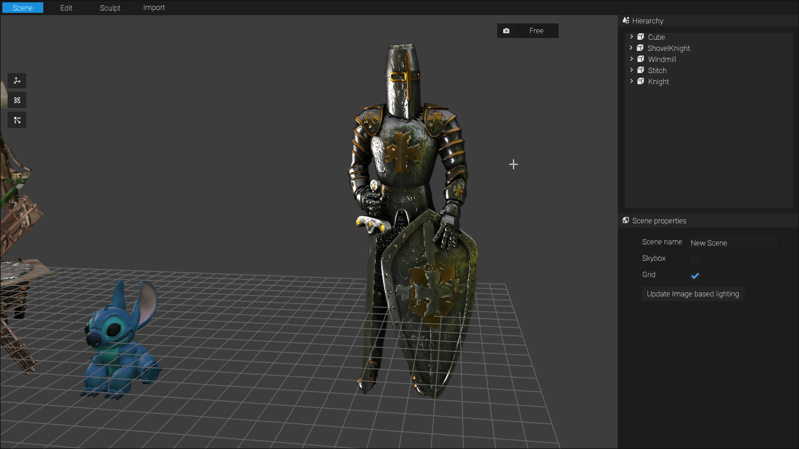
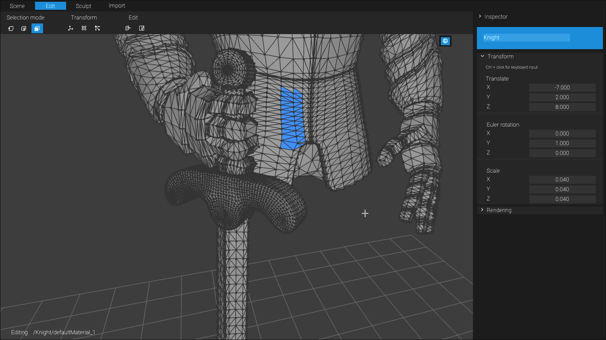
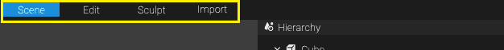
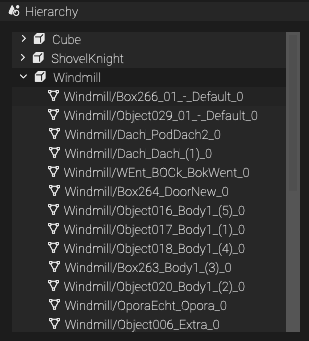
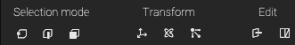

# 3D Modeling Tool

A 3D modeling tool running in the browser, supporting Physically Based Rendering (PBR) and Image-Based Lighting (IBL). Made entirely with JavaScript and WebGL.

[atelier3d.onrender.com](https://atelier3d.onrender.com)

## Development build

`git clone https://github.com/rigibon2/3d-modeling-tool.git`\
`cd 3d-modeling-tool`\
`npm install`\
`npm run dev`\

## Documentation

### Workspaces

The workflow is divided in 3 workspaces: scene, edit and sculpt

### Scene manager
All the models in the scene can be selected in the hierarchy panel. A model is composed by multiple meshes of which only one can be edited at a time.

Once an object is selected, the vertical transform toolbar can be used to move, rotate or scale it in the scene using the gizmos.

### Edit model topology
There are 3 selection modes: vertex, edges and faces. Each one is used to select the different elements that compose a mesh in a model. Once the selection of elements is done, it can be modified with the transform tools (translate, rotate and scale) or the edit tools (extrude and subdivide).

